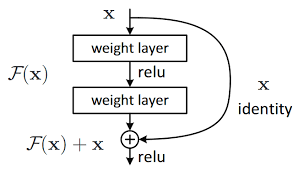
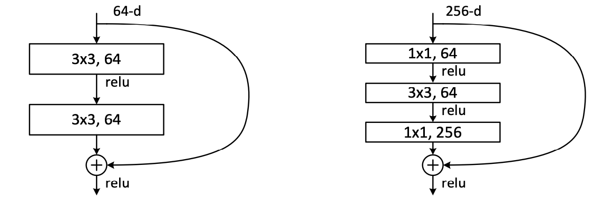
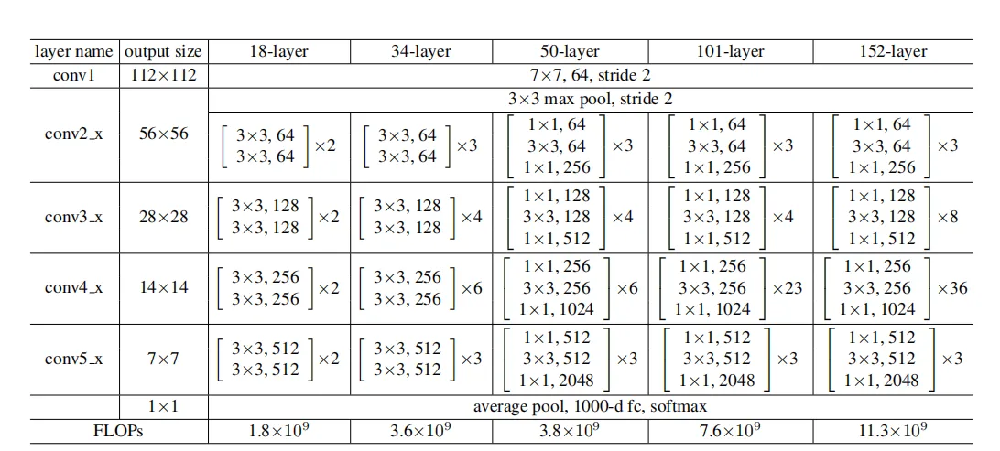

-----

# ResNet Implementation from Scratch

This repository provides a clean and modular implementation of various ResNet architectures as described in the paper, "[Deep Residual Learning for Image Recognition](https://arxiv.org/abs/1512.03385)". The project aims to provide a clear understanding of the ResNet architecture, including both the BasicBlock and Bottleneck variations, and to demonstrate their construction and functionality in PyTorch.

## Table of Contents

  - [ResNet Implementation from Scratch](#resnet-implementation-from-scratch)
      - [Table of Contents](#table-of-contents)
      - [About ResNet](#about-resnet)
      - [Features](#features)
      - [Implemented Architectures](#implemented-architectures)
      - [Project Structure](#project-structure)
      - [Getting Started](#getting-started)
          - [Prerequisites](#prerequisites)
          - [Installation](#installation)
          - [Usage](#usage)
      - [Model Details](#model-details)
          - [BasicBlock](#basicblock)
          - [Bottleneck Block](#bottleneck-block)
          - [ResNet Class](#resnet-class)
      - [Validation with `torchsummary`](#validation-with-torchsummary)

## About ResNet

Residual Networks (ResNets) revolutionized deep learning by introducing "skip connections" or "residual connections," allowing neural networks to be much deeper without suffering from the vanishing gradient problem. These connections enable the network to learn identity functions, making it easier to train deeper architectures and improve performance on various computer vision tasks.  



## Features

  * **Modular Design:** Separated `BasicBlock` and `Bottleneck` implementations for clarity and reusability.
  * **Customizable ResNet:** A flexible `ResNet` class that can construct different ResNet variants (ResNet-18, ResNet-34, ResNet-50, ResNet-101, ResNet-152) by simply passing configuration parameters.
  * **PyTorch Native:** Built entirely using PyTorch, leveraging its powerful `nn.Module` and automatic differentiation capabilities.
  * **Architecture Verification:** Includes functionality to compare the implemented ResNet's architecture and parameter count with `torchvision`'s pre-trained ResNet models using `torchsummary`.     

    

## Implemented Architectures

This project allows you to instantiate the following ResNet models:

  * ResNet-18
  * ResNet-34
  * ResNet-50
  * ResNet-101
  * ResNet-152  



## Project Structure

The core implementation is contained within a single Python script (e.g., `resnet_model.py` or a Jupyter Notebook if this is part of one).

```
.
├── resnet_implementation.ipynb  # Or resnet_model.py
├── README.md
└── requirements.txt
```

## Getting Started

Follow these instructions to get a copy of the project up and running on your local machine.

### Prerequisites

  * Python 3.x
  * PyTorch
  * Torchvision
  * Torchsummary

### Installation

1.  **Clone the repository:**

    ```bash
    git clone https://github.com/amanchauhan23/ResNet-Implementation.git
    cd ResNet-Implementation
    ```

2.  **Create a virtual environment (recommended):**

    ```bash
    python -m venv venv
    venv\Scripts\activate
    ```

3.  **Install dependencies:**

    ```bash
    pip install -r requirements.txt
    ```


### Usage

To run the provided code and instantiate a ResNet model:

1.  **Open the Jupyter Notebook (if applicable):**

    ```bash
    jupyter notebook resnet_implementation.ipynb
    ```

    Then, run all cells.

2.  **Alternatively, if it's a Python script:**

    ```bash
    python resnet_model.py
    ```

The output will include the shape of a sample forward pass output and a detailed summary of the chosen ResNet architecture (e.g., ResNet-50) generated by `torchsummary`, along with a comparison to the `torchvision` equivalent.

## Model Details

### BasicBlock

The `BasicBlock` is used in shallower ResNet architectures like ResNet-18 and ResNet-34. It consists of two 3x3 convolutional layers.

```python
class BasicBlock(nn.Module):
    expansion = 1
    def __init__(self, in_channels, out_channels, stride=1):
        super(BasicBlock, self).__init__()
        self.conv1 = nn.Conv2d(in_channels, out_channels, kernel_size=3, stride=stride, padding=1, bias=False)
        self.bn1 = nn.BatchNorm2d(out_channels)
        self.conv2 = nn.Conv2d(out_channels, out_channels * self.expansion, kernel_size=3, stride=1, padding=1, bias=False)
        self.bn2 = nn.BatchNorm2d(out_channels * self.expansion)
        self.shortcut = nn.Sequential()
        if stride != 1 or in_channels != out_channels * self.expansion:
            self.shortcut = nn.Sequential(
                nn.Conv2d(in_channels, out_channels * self.expansion, kernel_size=1, stride=stride, bias=False),
                nn.BatchNorm2d(out_channels * self.expansion)
            )

    def forward(self, x):
        out = F.relu(self.bn1(self.conv1(x)))
        out = self.bn2(self.conv2(out))
        out += self.shortcut(x)
        out = F.relu(out)
        return out
```

### Bottleneck Block

The `Bottleneck` block is used in deeper ResNet models (ResNet-50, ResNet-101, ResNet-152). It uses a 1x1 convolution to reduce dimensionality, followed by a 3x3 convolution, and then another 1x1 convolution to expand it back. This design is more computationally efficient for deeper networks.

```python
class Bottleneck(nn.Module):
    expansion = 4
    def __init__(self, in_channels, out_channels, stride=1):
        super(Bottleneck, self).__init__()
        self.conv1 = nn.Conv2d(in_channels, out_channels, kernel_size=1, bias=False)
        self.bn1 = nn.BatchNorm2d(out_channels)
        self.conv2 = nn.Conv2d(out_channels, out_channels, kernel_size=3, stride=stride, padding=1, bias=False)
        self.bn2 = nn.BatchNorm2d(out_channels)
        self.conv3 = nn.Conv2d(out_channels, out_channels * self.expansion, kernel_size=1, bias=False)
        self.bn3 = nn.BatchNorm2d(out_channels * self.expansion)
        self.shortcut = nn.Sequential()
        if stride != 1 or in_channels != out_channels * self.expansion:
            self.shortcut = nn.Sequential(
                nn.Conv2d(in_channels, out_channels * self.expansion, kernel_size=1, stride=stride, bias=False),
                nn.BatchNorm2d(out_channels * self.expansion)
            )

    def forward(self, x):
        out = F.relu(self.bn1(self.conv1(x)))
        out = F.relu(self.bn2(self.conv2(out)))
        out = self.bn3(self.conv3(out))
        out += self.shortcut(x)
        out = F.relu(out)
        return out
```

### ResNet Class

The main `ResNet` class orchestrates the construction of the entire network by stacking multiple `BasicBlock` or `Bottleneck` modules.

```python
class ResNet(nn.Module):
    def __init__(self, resnet_type, in_channels, num_classes):
        # ... (full implementation as in your code)
```

The `resnet_type` argument defines the specific ResNet variant, including the channel sizes, repetition counts for each block stage, and the expansion factor (1 for BasicBlock, 4 for Bottleneck).

Example `resnet_type` definitions:

```python
models = {}
models['resnet18'] = ([64, 128, 256, 512], [2, 2, 2, 2], 1)
models['resnet34'] = ([64, 128, 256, 512], [3, 4, 6, 3], 1)
models['resnet50'] = ([64, 128, 256, 512], [3, 4, 6, 3], 4)
models['resnet101'] = ([64, 128, 256, 512], [3, 4, 23, 3], 4)
models['resnet152'] = ([64, 128, 256, 512], [3, 8, 36, 3], 4)
```

## Validation with `torchsummary`

The project includes a validation step using `torchsummary` to print a detailed summary of the custom-built ResNet model, including layer types, output shapes, and parameter counts. This output is compared against the corresponding `torchvision` ResNet model to verify the implementation's correctness.

Example output for ResNet-50:

```
----------------------------------------------------------------
        Layer (type)               Output Shape         Param #
================================================================
              Conv2d-1         [-1, 64, 112, 112]           9,408
           BatchNorm2d-2         [-1, 64, 112, 112]             128
                  ReLU-3         [-1, 64, 112, 112]               0
             MaxPool2d-4           [-1, 64, 56, 56]               0
              Conv2d-5           [-1, 64, 56, 56]           4,096
           BatchNorm2d-6           [-1, 64, 56, 56]             128
              Conv2d-7           [-1, 64, 56, 56]          36,864
           BatchNorm2d-8           [-1, 64, 56, 56]             128
              Conv2d-9          [-1, 256, 56, 56]          16,384
          BatchNorm2d-10          [-1, 256, 56, 56]             512
             Conv2d-11          [-1, 256, 56, 56]          16,384
          BatchNorm2d-12          [-1, 256, 56, 56]             512
          Bottleneck-13          [-1, 256, 56, 56]               0
              Conv2d-14           [-1, 64, 56, 56]          16,384
          BatchNorm2d-15           [-1, 64, 56, 56]             128
              Conv2d-16           [-1, 64, 56, 56]          36,864
          BatchNorm2d-17           [-1, 64, 56, 56]             128
              Conv2d-18          [-1, 256, 56, 56]          16,384
          BatchNorm2d-19          [-1, 256, 56, 56]             512
          Bottleneck-20          [-1, 256, 56, 56]               0
              Conv2d-21           [-1, 64, 56, 56]          16,384
          BatchNorm2d-22           [-1, 64, 56, 56]             128
              Conv2d-23           [-1, 64, 56, 56]          36,864
          BatchNorm2d-24           [-1, 64, 56, 56]             128
              Conv2d-25          [-1, 256, 56, 56]          16,384
          BatchNorm2d-26          [-1, 256, 56, 56]             512
          Bottleneck-27          [-1, 256, 56, 56]               0
              Conv2d-28          [-1, 128, 56, 56]          32,768
          BatchNorm2d-29          [-1, 128, 56, 56]             256
              Conv2d-30          [-1, 128, 28, 28]         147,456
          BatchNorm2d-31          [-1, 128, 28, 28]             256
              Conv2d-32          [-1, 512, 28, 28]          65,536
          BatchNorm2d-33          [-1, 512, 28, 28]           1,024
              Conv2d-34          [-1, 512, 28, 28]         131,072
          BatchNorm2d-35          [-1, 512, 28, 28]           1,024
          Bottleneck-36          [-1, 512, 28, 28]               0
              Conv2d-37          [-1, 128, 28, 28]          65,536
          BatchNorm2d-38          [-1, 128, 28, 28]             256
              Conv2d-39          [-1, 128, 28, 28]         147,456
          BatchNorm2d-40          [-1, 128, 28, 28]             256
              Conv2d-41          [-1, 512, 28, 28]          65,536
          BatchNorm2d-42          [-1, 512, 28, 28]           1,024
          Bottleneck-43          [-1, 512, 28, 28]               0
              Conv2d-44          [-1, 128, 28, 28]          65,536
          BatchNorm2d-45          [-1, 128, 28, 28]             256
              Conv2d-46          [-1, 128, 28, 28]         147,456
          BatchNorm2d-47          [-1, 128, 28, 28]             256
              Conv2d-48          [-1, 512, 28, 28]          65,536
          BatchNorm2d-49          [-1, 512, 28, 28]           1,024
          Bottleneck-50          [-1, 512, 28, 28]               0
              Conv2d-51          [-1, 128, 28, 28]          65,536
          BatchNorm2d-52          [-1, 128, 28, 28]             256
              Conv2d-53          [-1, 128, 28, 28]         147,456
          BatchNorm2d-54          [-1, 128, 28, 28]             256
              Conv2d-55          [-1, 512, 28, 28]          65,536
          BatchNorm2d-56          [-1, 512, 28, 28]           1,024
          Bottleneck-57          [-1, 512, 28, 28]               0
              Conv2d-58          [-1, 256, 28, 28]         131,072
          BatchNorm2d-59          [-1, 256, 28, 28]             512
              Conv2d-60          [-1, 256, 14, 14]         589,824
          BatchNorm2d-61          [-1, 256, 14, 14]             512
              Conv2d-62         [-1, 1024, 14, 14]         262,144
          BatchNorm2d-63         [-1, 1024, 14, 14]           2,048
              Conv2d-64         [-1, 1024, 14, 14]         524,288
          BatchNorm2d-65         [-1, 1024, 14, 14]           2,048
          Bottleneck-66         [-1, 1024, 14, 14]               0
              Conv2d-67          [-1, 256, 14, 14]         262,144
          BatchNorm2d-68          [-1, 256, 14, 14]             512
              Conv2d-69          [-1, 256, 14, 14]         589,824
          BatchNorm2d-70          [-1, 256, 14, 14]             512
              Conv2d-71         [-1, 1024, 14, 14]         262,144
          BatchNorm2d-72         [-1, 1024, 14, 14]           2,048
          Bottleneck-73         [-1, 1024, 14, 14]               0
              Conv2d-74          [-1, 256, 14, 14]         262,144
          BatchNorm2d-75          [-1, 256, 14, 14]             512
              Conv2d-76          [-1, 256, 14, 14]         589,824
          BatchNorm2d-77          [-1, 256, 14, 14]             512
              Conv2d-78         [-1, 1024, 14, 14]         262,144
          BatchNorm2d-79         [-1, 1024, 14, 14]           2,048
          Bottleneck-80         [-1, 1024, 14, 14]               0
              Conv2d-81          [-1, 256, 14, 14]         262,144
          BatchNorm2d-82          [-1, 256, 14, 14]             512
              Conv2d-83          [-1, 256, 14, 14]         589,824
          BatchNorm2d-84          [-1, 256, 14, 14]             512
              Conv2d-85         [-1, 1024, 14, 14]         262,144
          BatchNorm2d-86         [-1, 1024, 14, 14]           2,048
          Bottleneck-87         [-1, 1024, 14, 14]               0
              Conv2d-88          [-1, 256, 14, 14]         262,144
          BatchNorm2d-89          [-1, 256, 14, 14]             512
              Conv2d-90          [-1, 256, 14, 14]         589,824
          BatchNorm2d-91          [-1, 256, 14, 14]             512
              Conv2d-92         [-1, 1024, 14, 14]         262,144
          BatchNorm2d-93         [-1, 1024, 14, 14]           2,048
          Bottleneck-94         [-1, 1024, 14, 14]               0
              Conv2d-95          [-1, 256, 14, 14]         262,144
          BatchNorm2d-96          [-1, 256, 14, 14]             512
              Conv2d-97          [-1, 256, 14, 14]         589,824
          BatchNorm2d-98          [-1, 256, 14, 14]             512
              Conv2d-99         [-1, 1024, 14, 14]         262,144
         BatchNorm2d-100         [-1, 1024, 14, 14]           2,048
         Bottleneck-101         [-1, 1024, 14, 14]               0
           Conv2d-102          [-1, 512, 14, 14]         524,288
         BatchNorm2d-103          [-1, 512, 14, 14]           1,024
           Conv2d-104            [-1, 512, 7, 7]       2,359,296
         BatchNorm2d-105            [-1, 512, 7, 7]           1,024
           Conv2d-106           [-1, 2048, 7, 7]       1,048,576
         BatchNorm2d-107           [-1, 2048, 7, 7]           4,096
           Conv2d-108           [-1, 2048, 7, 7]       2,097,152
         BatchNorm2d-109           [-1, 2048, 7, 7]           4,096
         Bottleneck-110           [-1, 2048, 7, 7]               0
           Conv2d-111            [-1, 512, 7, 7]       1,048,576
         BatchNorm2d-112            [-1, 512, 7, 7]           1,024
           Conv2d-113            [-1, 512, 7, 7]       2,359,296
         BatchNorm2d-114            [-1, 512, 7, 7]           1,024
           Conv2d-115           [-1, 2048, 7, 7]       1,048,576
         BatchNorm2d-116           [-1, 2048, 7, 7]           4,096
         Bottleneck-117           [-1, 2048, 7, 7]               0
           Conv2d-118            [-1, 512, 7, 7]       1,048,576
         BatchNorm2d-119            [-1, 512, 7, 7]           1,024
           Conv2d-120            [-1, 512, 7, 7]       2,359,296
         BatchNorm2d-121            [-1, 512, 7, 7]           1,024
           Conv2d-122           [-1, 2048, 7, 7]       1,048,576
         BatchNorm2d-123           [-1, 2048, 7, 7]           4,096
         Bottleneck-124           [-1, 2048, 7, 7]               0
AdaptiveAvgPool2d-125           [-1, 2048, 1, 1]               0
            Linear-126                 [-1, 1000]       2,049,000
================================================================
Total params: 25,557,032
Trainable params: 25,557,032
Non-trainable params: 0
----------------------------------------------------------------
Input size (MB): 0.57
Forward/backward pass size (MB): 219.37
Params size (MB): 97.49
Estimated Total Size (MB): 317.44
----------------------------------------------------------------
```